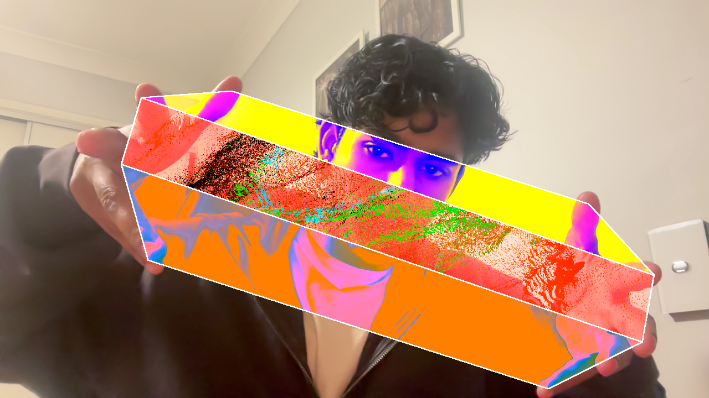

# Hand Filter

A hand-tracked visual effect in TouchDesigner, inspired by the "manual tracking" trend seen on Instagram/TikTok. A quad is corner-pinned between three finger-pairs on each hand (thumb–index, index–middle, middle–pinky), masking a filtered copy of the webcam feed with a white outline on top.

## How it works

- **MediaPipe-TouchDesigner** plugin provides real-time hand landmark tracking (21 points per hand, both hands).
- Fingertip positions (`thumb_tip`, `index_finger_tip`, `middle_finger_tip`, `pinky_tip`) drive three Corner Pin TOPs, each spanning one finger-pair across both hands.
- Each quad masks a differently-filtered, recoloured copy of the video:
  - **Band 1** (thumb–index): RGB Contrast
  - **Band 2** (index–middle): Pixel Relocator → recolour
  - **Band 3** (middle–pinky): Solarize → recolour
- Filters run *before* the mask, not after — displacement effects (like Pixel Relocator) shift the alpha channel along with the colour, so masking first would let the effect spill outside its quad.
- An Edge TOP outlines each quad; all layers composite over the live camera feed.

### Missing-hand handling

If only one hand is tracked (or a hand briefly drops out), the corresponding fingertip channels default to `(0, 0)` — without correction this stretches a quad's corners toward the top-left of the frame, producing a visible smear. Each band has a `Level TOP` gate (`gate1`/`gate2`/`gate3`) that checks whether *both* the left-hand and right-hand corners for that band are genuinely tracked (not sitting at the zero-default), and sets the band's opacity to 0 if not. Effect bands disappear cleanly instead of showing corrupted geometry whenever fewer than two hands are in frame.

## Requirements

- [TouchDesigner](https://derivative.ca/) (2025.x)
- [MediaPipe for TouchDesigner](https://github.com/torinmb/mediapipe-touchdesigner) plugin, active and configured for hand + gesture detection
- A webcam

## Running it

Open `Hand Filter.toe`, confirm the webcam feed is live in the `video_in` node, and hold both hands up in frame with fingers spread. The Perform window (`out1`) shows the composited output.

## Troubleshooting

- **Nothing tracks / all bands invisible with both hands up:** check the timeline is playing (`⏵` in the transport bar). TouchDesigner stops cooking entirely when paused, which silently freezes hand tracking.
- **A band collapses or stretches oddly:** make sure both the fingertip and its pair are clearly in frame and well-lit — MediaPipe needs a clean view of both hands to resolve every landmark.
